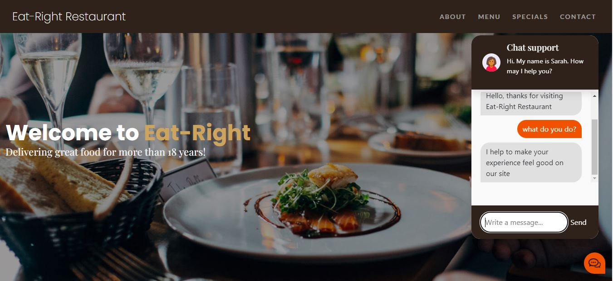
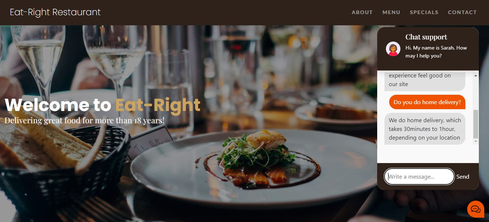

# Restaurant-website

> This is a frontend design of a fully functional website with chatbot integration

[![HTML]
[![CSS]
[![Bootstrap]
[![JavaScript]
This is a frontend web project, which I integrated with a functional backend chatbot server on my local server. I was not able to deploy the backend on heroku server as I earlier planned, but the images below are samples of me testing the chatbot locally. The sample code for the backend is in my repository.

